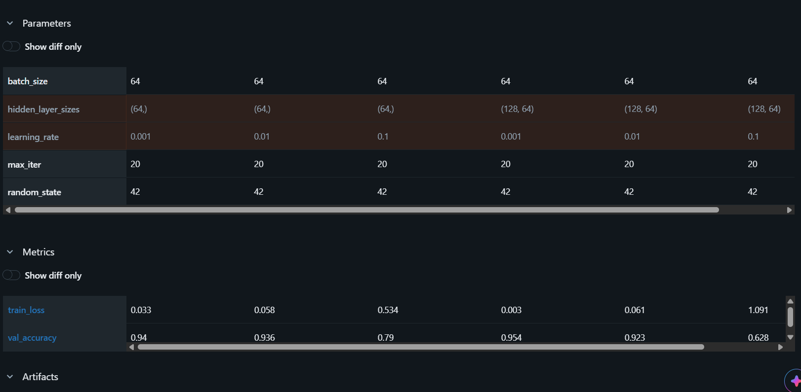

# AIOps Assignment 1: QUESTION 2

## 1. MLflow Run Comparison Table


---

## 2. Written Analysis

Across the six experimental runs, **Run 4 (learning_rate=0.001, hidden_layer_sizes=(128, 64))** achieved the best overall performance, attaining the highest validation accuracy of **95.40% (0.954)** and the lowest training loss of **0.003**. The deeper two-layer architecture effectively captured the complex spatial representations of handwritten digits without destabilizing.

### Overfitting vs. Optimization Divergence:
Rather than standard overfitting (where training loss continues to drop while validation accuracy degrades), aggressive learning rates (**learning_rate=0.1**) caused severe optimization divergence:
- In the single-layer setup `(64,)` at `lr=0.1`, training loss remained elevated at **0.534** with validation accuracy dropping to **79.00%**.
- In the deeper setup `(128, 64)` at `lr=0.1`, training loss spiked to **1.091** and validation accuracy degraded sharply to **62.80%**.

At the optimal learning rate of `0.001`, both architectures converged smoothly without evidence of overfitting within the 20-epoch constraint.

### Hyperparameter Sensitivity:
The **learning rate** had a significantly larger impact on model performance than network depth. Expanding hidden layers from `(64,)` to `(128, 64)` yielded an accuracy improvement of **1.4%** at `lr=0.001` (from 0.940 to 0.954). In contrast, scaling the learning rate from `0.001` to `0.1` degraded performance by **15.0%** in the single-layer architecture and **32.6%** in the deeper network.

---

## 3. Exact MLflow Logging Code Added to Starter Script

```python
# Parameters
mlflow.log_param("learning_rate", cfg["lr"])
mlflow.log_param("hidden_layer_sizes", str(cfg["hidden_layers"]))
mlflow.log_param("max_iter", 20)
mlflow.log_param("batch_size", 64)
mlflow.log_param("random_state", 42)

# Metrics
mlflow.log_metric("train_loss", train_loss)
mlflow.log_metric("val_accuracy", val_accuracy)

# Model Artifact
mlflow.sklearn.log_model(
    sk_model=mlp,
    artifact_path="model",
    serialization_format=mlflow.sklearn.SERIALIZATION_FORMAT_CLOUDPICKLE
)